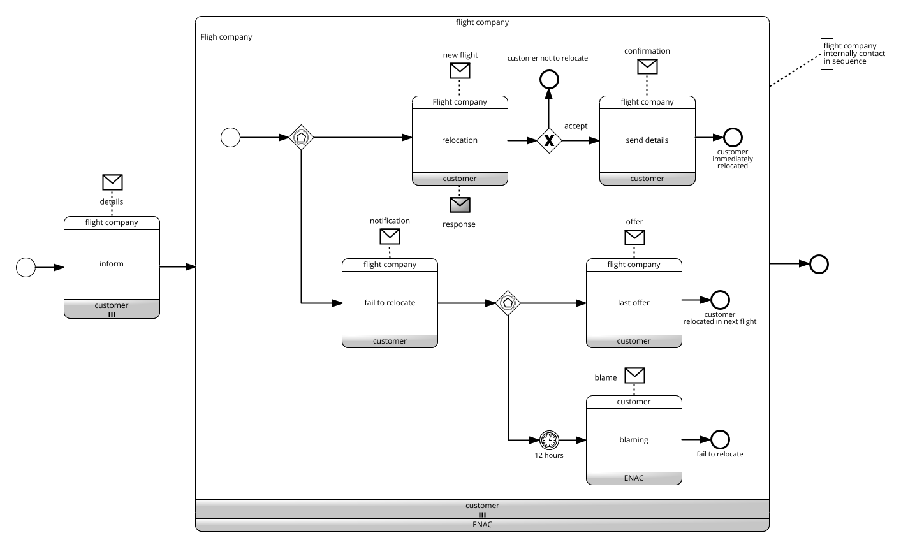

# Flight Booking

Model with BPMN Choreography the following process describing the process to manage a flight booking in case of strike.

The process begins when the airline learns that the flight cannot operate due to the cabin crew strike. As a first action, the airline informs all the involved passengers about the situation. Then the airline identifies the flight where to relocate the travelers. It might happen that the number of seats available are not enough to cover all the passengers. Thus, the airline operates as follows: the airline contacts, one after the other, all travelers and inform them of the new flight. The traveler, having acquired the information, can accept the offer or decline it. In the second case, the process from the traveler standpoint ends. In the former case, the airline assigns the seat, sends the ticket to the traveler and, if there is room for other travelers moves to the next. If at the end of the round all the travelers have been contacted and properly managed the process ends, otherwise, the company informs the remaining travelers of the failure to relocate and informs them that, within 12 hours, they will be able to receive new information. During this time, the airline will look for alternative solutions and send travelers the final offer that they will not be able to refuse. If the alternative offer does not arrive within the agreed 12 hours, the traveler can send a message to the ENAC (National Flight Authority) protesting after which, independently, s/he will look for alternative solutions with other companies.

Click to download the [BPMN diagrams*](../signavio-export/FlightBooking-Choreo.bpmn)

*All diagrams have been authored with SAP Signavio under Academic license
