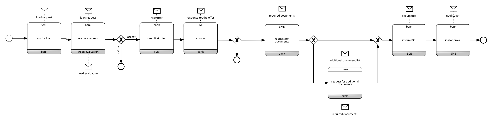
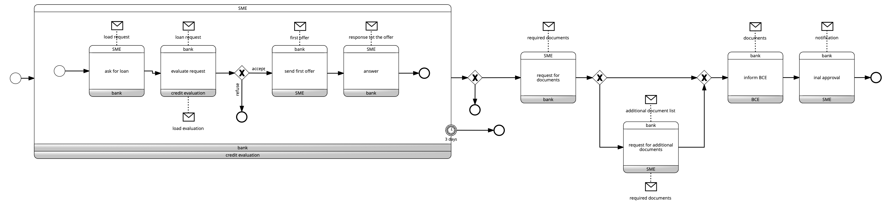

# Loan MI

The process begins when the small and medium-sized enterprise (SME) applies for a mortgage specifying
the value of the loan requested. LoanMI, after analyzing the financial solidity of the applicant by asking
to a credit assessment company, can immediately deny the request, or submit a first offer. In the first case,
of course, the process ends. If LoanMI responds with an offer, the requesting company has the right to
accept or refuse. 

In case SME accepts, the bank will wait for all the necessary documents. LoanMI then analyzes the
documents and can contact the SME for further documents if necessary. Once all the information has
been obtained, LoanMI sends all the documentation to the European Central Bank and the process ends
after a notification to the SME.

## Variant

Please note that no more than 3 days may elapse between the time the request is made by
the SME and the SME accepts or refuses, otherwise the process is considered to have been completed by
both parties.

Click to download the [BPMN diagrams in XML*](../signavio-export/LoanMI-Choreo.bpmn)

*All diagrams have been authored with SAP Signavio under Academic license