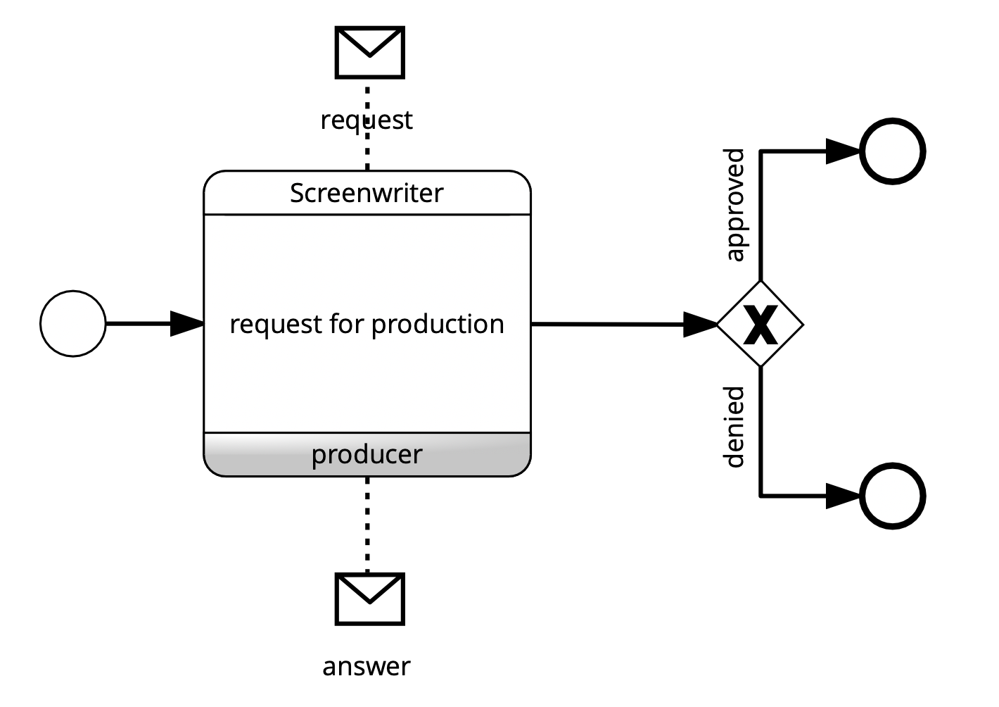
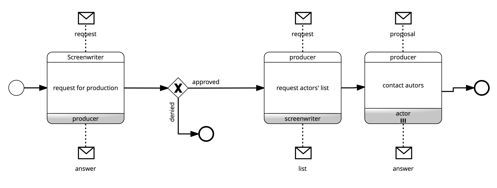
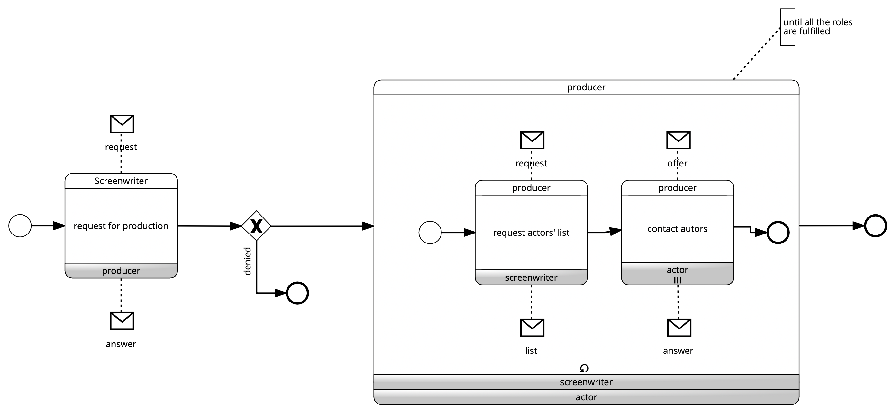
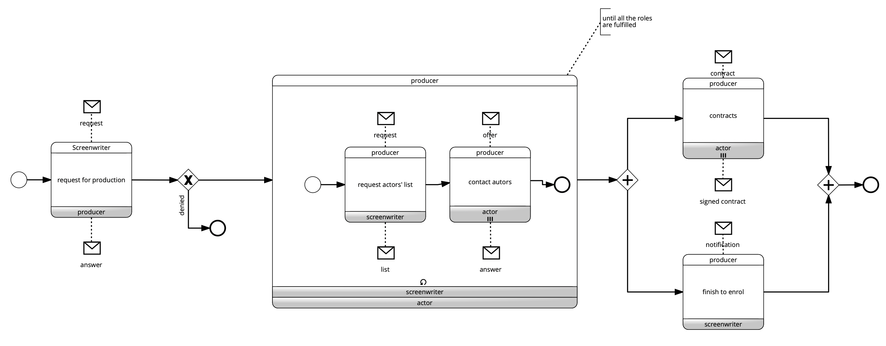

# Movie Maker

The process begins when the screenwriter, having completed the script, submits it to a producer. After
analyzing it, the producer can decide to support the production or reject it. In the latter case, the
screenwriter may revise the story and submit it to another producer following the previously defined
process.

If the producer agrees to support the production costs, s/he ask the screenwriter for a list of actors deemed
suitable for various roles. Once the list is obtained, the producer may reserve the right to modify names
and then begins to contact these actors, collecting their responses. 

If any roles remain unfilled, the producer asks the screenwriter for names again, and after a possible revision, contacts the new names. This series of activities continues until all roles are filled.

Once the list of actors is finalized, the producer shares it with her/his administration to send contracts to
the actors. The process concludes when all contracts are received and signed and the screenwriter is notified with the list of actors that are going to sign.

Click to download the [BPMN diagrams*](../signavio-export/MovieMaker-Choreo.bpmn)

*All diagrams have been authored with SAP Signavio under Academic license