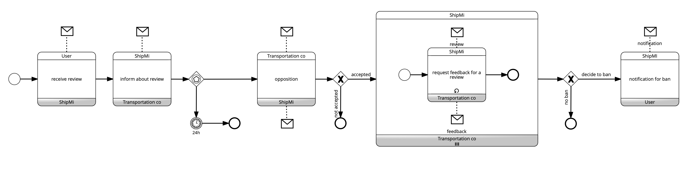

# ShipMI

ShipMi is a logistics services brokerage company to which several Italian transporters are affiliated.
Model the process with BPMN Choreography related to the management of reviews submitted by the
final customers of the transporters.
The first activity is performed by the user who, after using the service, connects to the ShipMI system to
enter a review for a transporter. Once entered and published on the site, the system sends an email to the
transporter who provided the service. The transporter has 24 hours to respond by requesting the removal
of the review if it is defamatory. In this case, ShipMi, having received the removal request, evaluates the
situation and decides whether to accept the request or not, informing the transport company of the
decision.
If the request is not accepted, the process ends. If the request is accepted, ShipMI checks the number of
reviews previously submitted by the same user and contacts the transport companies that have been
affected by at least one review to ask for feedback regarding the reviews made by the user in question.
For this purpose, ShipMi sends a feedback request for each review submitted to the relevant transport
company. If the latter finds an inaccuracy in at least one of the reviews, then the user is suspended after
being informed via email.

*All diagrams have been authored with SAP Signavio under Academic license