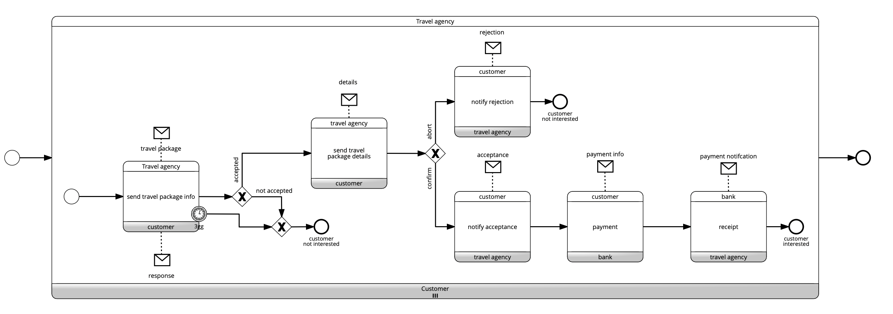

# Travel

Model with BPMN Choreography the following process describing the process undertaken by a travel agency to organize a new travel package.

The process begins with the travel agency querying its database to retrieve the list of clients who have given their consent to receive information about new initiatives. To each of these clients, the travel agency sends a proposal for a travel package. After reviewing the proposal, the client may choose to accept it or ignore it. The travel agency waits for a period of three days, after which it considers the client uninterested if no response is received.

Once all responses have been collected, the travel agency provides detailed information about the travel package, including prices, but only to the clients who expressed interest. At this point, the customer proceeds to make a final decision. In the case of acceptance, the customer indicates in their response the specific elements of the package they are interested in and initiates a bank transfer for the required amount to the travel agency's designated bank.

The travel agency then awaits confirmation from the bank, in the form of payment receipts for each participating customer. Once all receipts have been received, the process is concluded.

Click to download the [BPMN diagrams*](../signavio-export/Travel-Choreo1.bpmn)

*All diagrams have been authored with SAP Signavio under Academic license
