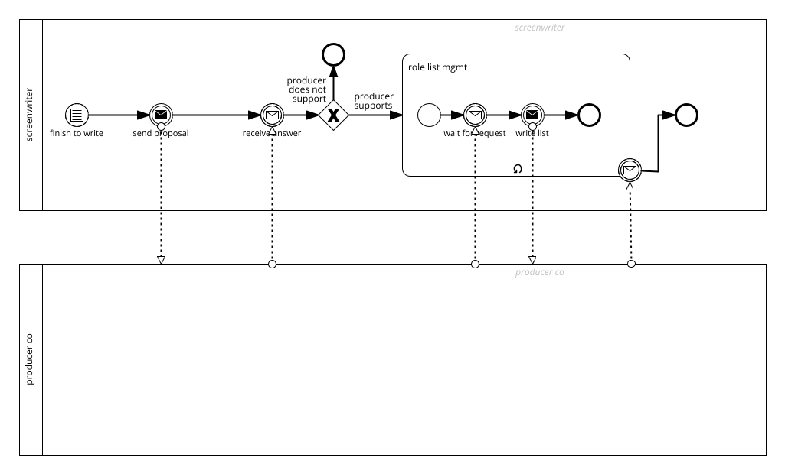
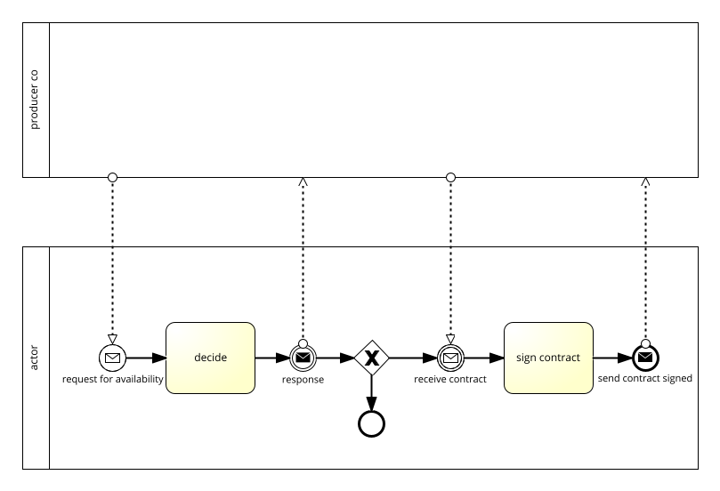

# MovieMaker

Focusing the process defined in [MovieMaker](/choreography/MovieMaker.md) which choreography is here reported

 model with a BPMN Collaborative process the interaction among all the involved actors excluding the user that makes the reviews.

### Screenwriter viewpoint

Click to download the [BPMN diagram in XML*](../signavio-export/MovieMaker-Collaboration-Screenwriter.bpmn)

### Producer viewpoint

Click to download the [BPMN diagram in XML*](../signavio-export/MovieMaker-Collaboration-Producer.bpmn)

### Actor viewpoint

Click to download the [BPMN diagram in XML*](../signavio-export/MovieMaker-Collaboration-Actor.bpmn)

*All diagrams have been authored with SAP Signavio under Academic license